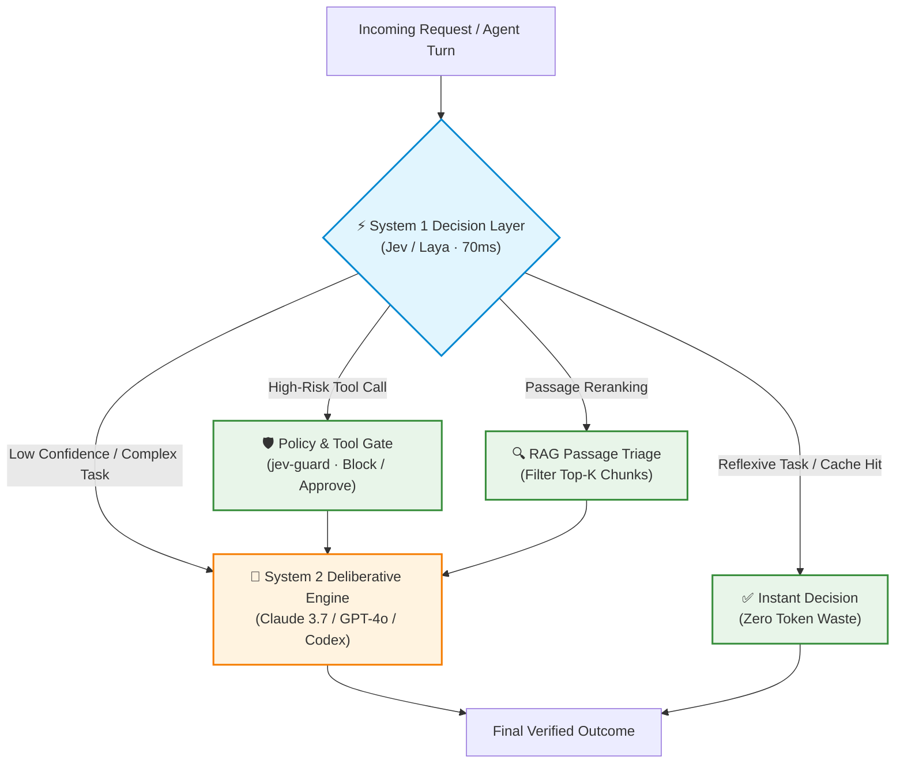

<div align="center">

# Awesome Jev [](https://awesome.re)

### A curated list of awesome projects, models, libraries, blueprints, and resources built around TypeSafe Jev, Laya, and the System One typed decision paradigm.

[](LICENSE)
[](CONTRIBUTING.md)
[](#scientific-foundations--research)

<br/>

</div>

**System One models** represent a fundamental shift in AI engineering: replacing slow, expensive, autoregressive text generation for routine judgments with ultra-low latency (30–150ms), strictly schema-constrained decisions with calibrated confidence probabilities.

---

## Contents

- [The 10-Second Mental Model](#the-10-second-mental-model)
- [Dual-Process Architecture](#dual-process-architecture)
- [The 3 Typed Primitives](#the-3-typed-primitives)
- [SDKs by Language & Frameworks](#sdks-by-language--frameworks)
- [Production Blueprints](#production-blueprints)
- [Scientific Foundations & Research](#scientific-foundations--research)
- [Official & Foundational Tooling](#official--foundational-tooling)
- [Open-Weight Models & Local Runtimes](#open-weight-models--local-runtimes)
- [Agent Tool Gating & Safety](#agent-tool-gating--safety)
- [Memory & Token Economics](#memory--token-economics)
- [Search, RAG & Semantic Grep](#search-rag--semantic-grep)
- [Code Intelligence & Verification](#code-intelligence--verification)
- [Dynamic Routing & Model Dispatch](#dynamic-routing--model-dispatch)
- [Vision & Computer Use](#vision--computer-use)
- [Evaluation & Calibration](#evaluation--calibration)
- [Harness Integration Quickstart](#harness-integration-quickstart)
- [Official Resources & Community](#official-resources--community)
- [Contributing](#contributing)

---

## The 10-Second Mental Model

> **Stop using a bazooka to swat a fly.**

Most AI agents burn compute by prompting a frontier Large Language Model (LLM) to make binary or categorical choices:
* *"Is this customer support ticket about billing?"*
* *"Should the agent execute the `delete_database` tool?"*
* *"Is this retrieved document relevant to the user's question?"*

Running these through **System 2** (Claude 3.7, GPT-4o, Gemini 2.5 Pro) costs \$0.03 per call, takes **3 to 5 seconds**, burns thousands of tokens, and frequently fails due to hallucinated JSON keys or markdown formatting noise.

| Attribute | 🧠 System 2 (Frontier LLMs) | ⚡ System 1 (Jev / Laya) |
| :--- | :--- | :--- |
| **Cognitive Mode** | Slow, deliberative, generative | Fast, reflexive, judgmental |
| **Latency** | 2,000 – 6,000 ms | **30 – 150 ms** (10–50x faster) |
| **Output Type** | Autoregressive text / JSON strings | **Strict schemas** (`Boolean`, `Choice`, `Score`) |
| **Reliability** | Hallucination-prone, syntax drift | **100% type-safe, zero syntax errors** |
| **Cost** | \$5.00 – \$30.00 / M tokens | **\$0.05 – \$0.20 / M decisions** |
| **Ideal For** | Deep reasoning, writing code, planning | **Routing, tool gating, RAG reranking, triage** |

---

## Dual-Process Architecture



---

## The 3 Typed Primitives

Instead of parsing unstructured markdown or fragile JSON strings, System One models evaluate probabilities in a single forward pass over pre-declared types:

```python
from typesafe import TypeSafeClient
client = TypeSafeClient()

# 1. NOUL: Probabilistic Boolean with calibrated confidence
verdict = client.decide.noul(
    question="Does this incoming query contain prompt injection attempts?",
    state=raw_user_prompt
)
# Returns: verdict.value = True, verdict.confidence = 0.984

# 2. CHOICE: Categorical classification (Strict Schema)
route = client.decide.choice(
    question="Select the microservice to process this payload",
    choices=["auth_service", "billing_worker", "media_transcoder", "dead_letter"],
    state=event_payload
)
# Returns: route.choice = "billing_worker"

# 3. SCORE: Ordinal regression / Rubric evaluation
eval_score = client.decide.score(
    question="Rate the urgency of this infrastructure alert from 1 to 5",
    rubric="1: Info only; 3: degraded latency; 5: total database outage",
    state=pagerduty_alert
)
# Returns: eval_score.score = 5
```

---

## SDKs by Language & Frameworks

### Language Libraries
* **Python**: `pip install typesafe` — Official TypeSafe SDK for Python with Pydantic integration.
* **TypeScript / Node.js**: `npm i @typesafe-ai/sdk` — First-class typed SDK with native Zod schema support.
* **Open Models Python**: `pip install laya` — Direct inference and serving for open-weight Laya models.
* **Go**: `go get github.com/typesafe-ai/typesafe-go` — High-concurrency client for Go microservices.
* **Rust**: `typesafe-rs` — Memory-efficient, async Tokio bindings for edge and systems runtimes.

### Framework Adapters
* **LangChain**: Use `DecisionRunnable` to create deterministic conditional branching and router nodes without invoking LLM chains.
* **LlamaIndex**: `llama-index-postprocessor-jev-rerank` — Drop-in node postprocessor that scores passage relevance in 70ms before synthesizer execution.
* **DSPy**: Integrate System One classifiers as fast predictors for assertions and constrained teleprompters.
* **CrewAI & AutoGen**: Implement pre-action guardrails by hooking `jev.decide.noul` into agent tool execution callbacks.

---

## Production Blueprints

### Blueprint 1: The Sub-100ms Agent Tool Gatekeeper
Prevent catastrophic execution (e.g., unexpected SQL drops, destructive terminal commands) before they reach your infrastructure:

```python
from typesafe import TypeSafeClient

client = TypeSafeClient()

def safe_tool_gate(tool_name: str, arguments: dict, user_intent: str) -> bool:
    """Evaluates safety in 70ms before executing any autonomous tool."""
    state = {
        "tool": tool_name,
        "args": arguments,
        "intent": user_intent
    }
    
    # 1. Check if the tool invocation adheres strictly to user authorization
    verdict = client.decide.noul(
        question="Is this specific tool execution explicitly requested and safe under the given user intent?",
        state=state
    )
    
    if not verdict.value or verdict.confidence < 0.95:
        print(f"Blocked tool execution: {tool_name} (Confidence: {verdict.confidence:.2%})")
        return False
        
    return True
```

### Blueprint 2: High-Speed RAG Passage Triage
Eliminate irrelevant retrieval noise before prompting your generative LLM:

```python
def filter_passages(query: str, retrieved_chunks: list[str]) -> list[str]:
    """Prunes retrieved chunks down to high-confidence evidence in parallel."""
    relevant_chunks = []
    
    for chunk in retrieved_chunks:
        check = client.decide.noul(
            question=f"Does this passage contain direct factual evidence to answer: '{query}'?",
            state=chunk
        )
        if check.value and check.confidence >= 0.85:
            relevant_chunks.append(chunk)
            
    return relevant_chunks
```

### Blueprint 3: Zero-Latency Microservice Router
Route incoming webhooks or user tickets without paying frontier model costs:

```python
def dispatch_event(payload: dict) -> str:
    """Routes payloads to the correct microservice queue in 50ms."""
    route = client.decide.choice(
        question="Which system domain does this incoming event belong to?",
        choices=["billing", "user_auth", "infra_alert", "marketing_spam"],
        state=payload
    )
    return route.choice
```

---

## Scientific Foundations & Research

Peer-reviewed literature, consensus evidence, and empirical benchmarks supporting the System One decision paradigm:

### Dual-Process & Cognitive Routing
* **R2R: Efficiently Navigating Divergent Reasoning Paths with Small-Large Model Token Routing** (NeurIPS 2025)  
  *Authors:* Tianyu Fu, Yi Ge, Yichen You, Enshu Liu, Zhihang Yuan, Guohao Dai, Shengen Yan, Huazhong Yang, Yu Wang (Tsinghua University)  
  *Links:* [arXiv:2505.21600](https://arxiv.org/abs/2505.21600) · [PDF](https://arxiv.org/pdf/2505.21600) · [Code (GitHub)](https://github.com/thu-nics/R2R)  
  *Finding:* Proves that delegating critical decision boundaries to specialized fast models while reserving LLMs for path synthesis delivers a 2.8× speedup and cuts latency by up to 70%.

* **Doing More with Less: A Survey on Routing Strategies for Resource Optimisation in Large Language Model-Based Systems** (2025)  
  *Authors:* Clovis Varangot-Reille, et al.  
  *Links:* [arXiv:2502.00409](https://arxiv.org/abs/2502.00409) · [PDF](https://arxiv.org/pdf/2502.00409)  
  *Finding:* Comprehensive taxonomy of similarity, supervised, and generative routing strategies, proving dynamic triage systems maintain high accuracy at a fraction of frontier compute cost.

* **Hybrid LLM: Cost-Efficient and Quality-Aware Query Routing** (ICLR 2024)  
  *Authors:* Dujian Ding, et al.  
  *Links:* [arXiv:2404.14618](https://arxiv.org/abs/2404.14618) · [OpenReview](https://openreview.net/forum?id=02f3mUtqnM) · [PDF](https://arxiv.org/pdf/2404.14618)  
  *Finding:* Demonstrates up to 60% API cost reductions by placing lightweight classifiers ahead of generative LLMs with zero quality degradation.

### Constrained Schemas & Zero Hallucination
* **Grammar-Constrained Decoding for Structured NLP Tasks without Finetuning** (EMNLP 2023)  
  *Authors:* Saibo Geng, Martin Josifoski, Maxime Peyrard, Robert West (EPFL)  
  *Links:* [arXiv:2305.13971](https://arxiv.org/abs/2305.13971) · [PDF](https://arxiv.org/pdf/2305.13971) · [DOI](https://doi.org/10.18653/v1/2023.emnlp-main.687)  
  *Finding:* Enforces formal context-free grammars (JSON/YAML) during decoding, completely eliminating syntactic failures and hallucinated fields.

* **JSONSchemaBench: A Rigorous Benchmark of Structured Outputs for Language Models** (2025)  
  *Authors:* Saibo Geng, Hudson Cooper, Michał Moskal, Julian Berman, Eric Horvitz, Harsha Nori (Microsoft Research & EPFL)  
  *Links:* [arXiv:2501.10868](https://arxiv.org/abs/2501.10868) · [PDF](https://arxiv.org/pdf/2501.10868)  
  *Finding:* Verifies 100% formal schema compliance across complex nested schemas using grammar-guided decoding frameworks.

* **Automata-Based Constraints for Language Model Decoding** (2024)  
  *Authors:* Terry Koo, Frederick Liu, Luheng He (Google DeepMind)  
  *Links:* [arXiv:2407.08103](https://arxiv.org/abs/2407.08103) · [PDF](https://arxiv.org/pdf/2407.08103)  
  *Finding:* Applies finite-state automata theory to compute closed-form masks for regular and deterministic context-free languages during decoding.

### Model Cascades, Calibration & Safety
* **UCCI: Calibrated Uncertainty for Cost-Optimal LLM Cascade Routing** (2026)  
  *Authors:* Varun Kotte  
  *Links:* [arXiv:2605.18796](https://arxiv.org/abs/2605.18796) · [PDF](https://arxiv.org/pdf/2605.18796)  
  *Finding:* Calibration-first router uses isotonic regression to map uncertainty to error probability, cutting inference costs by 31% and dropping Expected Calibration Error (ECE) from 0.12 to 0.03.

* **Safety Guardrails for LLM-Enabled Robots** (IEEE Robotics and Automation Letters 2025)  
  *Authors:* Zachary Ravichandran, Alexander Robey, Vijay Kumar, George J. Pappas, Hamed Hassani (University of Pennsylvania)  
  *Links:* [arXiv:2503.07885](https://arxiv.org/abs/2503.07885) · [PDF](https://arxiv.org/pdf/2503.07885)  
  *Finding:* Verifies that deterministic policy gating (RoboGuard) reduces unsafe autonomous agent plan executions from 92% to under 3%.

* **Retrieve Fast, Rerank Smart: Cooperative and Joint Approaches for Improved Retrieval** (TACL 2021)  
  *Authors:* Gregor Geigle, Jonas Pfeiffer, Nils Reimers, Iryna Gurevych  
  *Links:* [arXiv:2104.09277](https://arxiv.org/abs/2104.09277) · [PDF](https://arxiv.org/pdf/2104.09277)  
  *Finding:* Proves that sub-100ms cross-encoder reranking eliminates vector search noise and outperforms pure bi-encoder embeddings by wide margins.

---

## Official & Foundational Tooling

* [typesafe-ai/skills](https://github.com/typesafe-ai/skills) - Official TypeSafe reference skill package for coding agents. Teaches agents how to formulate typed queries and use recipes.
* [jkudish/jev-mcp](https://github.com/jkudish/jev-mcp) - Model Context Protocol (MCP) server providing 11 standard decision tools (`jev_noul`, `jev_classify`, `jev_rerank`, `jev_review`, etc.) for OpenCode, Claude Desktop, Cursor, and Zed.
* [UditAkhourii/quicksilver](https://github.com/UditAkhourii/quicksilver) - "Read widely, decide narrowly." High-speed triage skill that screens large file batches down to key candidates before prompting, slashing token usage by up to 90%.

---

## Open-Weight Models & Local Runtimes

Self-hosted and open-weight models that run locally or implement the `/v1/systemone` wire protocol:

* [NandhaKishorM/laya](https://github.com/NandhaKishorM/laya) - The foundational open-weight non-autoregressive decision model. 100+ languages in a single forward pass, ~33ms latency. Weights on Hugging Face (`convaiinnovations/laya`).
* [jaredpalmer/kev](https://github.com/jaredpalmer/kev) - Drop-in `/v1/systemone` server based on Qwen3.5/3.8 (0.8B–27B). Works seamlessly with TypeSafe SDKs; includes custom fine-tuning recipes.
* [mizorewww/laya-mlx](https://github.com/mizorewww/laya-mlx) - Optimized Apple Silicon MLX port of Laya weights. 13.4ms median latency with zero token generation overhead.
* [feder-cr/jev](https://github.com/feder-cr/jev) - `jevos` GGUF engine running on consumer CPUs in 50–220ms without requiring a dedicated GPU.
* [ollaya-dev/ollaya](https://github.com/ollaya-dev/ollaya) - "The Ollama for Decision Models." Local daemon for downloading and serving Laya and typed decision models with one command.
* [TianyuCodings/NanoJev](https://github.com/TianyuCodings/NanoJev) - 0.6B parameter ultra-compact replica for microsecond edge triage.
* [razorback16/openjev](https://github.com/razorback16/openjev) - DiffusionGemma 26B reading directly from probability logits with multimodal image prompt support.
* [1Panel-dev/laya-server](https://github.com/1Panel-dev/laya-server) - Dockerized self-hosted Laya server with built-in Web UI and API key management.

---

## Agent Tool Gating & Safety

* [leepokai/jev-guard](https://github.com/leepokai/jev-guard) - Pre-execution risk gate. Evaluates tool calls against 3 safety questions before running, preventing runaway loops in autonomous agents.
* [reticlehq/reticle](https://github.com/reticlehq/reticle) - Runtime verification engine. Drives headless browsers and containers to verify agent completion claims against real outputs, returning structured `pass/fail` with line traces.
* [supercorp-ai/supercov](https://github.com/supercorp-ai/supercov) - Evaluates code diffs for uncovered execution branches and converts gaps into targeted test generation prompts.

---

## Memory & Token Economics

* [tamaratran/fast-jev-compaction](https://github.com/tamaratran/fast-jev-compaction) - Drops unneeded tool results and logs using Jev decisions. Never writes lossy summaries; preserves code history verbatim.
* [hyperspaceai/jevcache](https://github.com/hyperspaceai/jevcache) - Local caching proxy for `(model, schema, state)` tuples. Zero API costs on repeated CI or agent unit runs.
* [tamaratran/jev-pruner](https://github.com/tamaratran/jev-pruner) - Post-execution hook that prunes command output before returning to the model; automatically whitelists errors and git diffs.
* [GhalebDweikat/winnow](https://github.com/GhalebDweikat/winnow) - Evaluates 25-line text blocks with Jev; stubs irrelevant sections with recall pointers.

---

## Search, RAG & Semantic Grep

* [dzhng/jevgrep](https://github.com/dzhng/jevgrep) - Semantic code search CLI. Locates files by architectural purpose rather than brittle regex strings.
* [milvus-io/bootcamp](https://github.com/milvus-io/bootcamp/tree/master/bootcamp/RAG/search_with_jev) - Official Milvus recipes combining vector search with fast Jev reranking, filtering, and search stopping.
* [anessbelbati/jev-rerank-bench](https://github.com/anessbelbati/jev-rerank-bench) - Fourteen-dataset reranking benchmark measuring latency and accuracy against cross-encoder baselines.
* [zhuyansen/jev-search-rerank-eval](https://github.com/zhuyansen/jev-search-rerank-eval) - Bilingual retrieval evaluation comparing Jev reranking with lexical, embedding, and hybrid search.

---

## Code Intelligence & Verification

* [devagrawal09/jev-review](https://github.com/devagrawal09/jev-review) - Multi-stage git diff reviewer: Noul risk matrix → file profile classification → severity scoring → routing.
* [uehaj/jev-semgrep](https://github.com/uehaj/jev-semgrep) - Multilingual semantic code search capable of matching architectural concepts across 6 programming languages.
* [keltokhy/jsort](https://github.com/keltokhy/jsort) - Sorts and prioritizes compiler warnings, linter feedback, and static analysis outputs by architectural severity.

---

## Dynamic Routing & Model Dispatch

* [gargpratyush/jev-router](https://github.com/gargpratyush/jev-router) - Terminal router selecting between Claude Code and Codex per turn while preserving native terminal interfaces and session state.
* [nidhi-singh02/agent-router](https://github.com/nidhi-singh02/agent-router) - Quota-aware router that applies deterministic rules before escalating difficult queries to frontier LLMs.
* [angel291592/Intent-Router](https://github.com/angel291592/Intent-Router) - Fast intent classifier routing user prompts to specialized domain agents.

---

## Vision & Computer Use

* [browser-use/jev-ultrafast](https://github.com/browser-use/jev-ultrafast) - Ultra-low latency UI classification and action triage for autonomous browser automation.
* [v-modal/awesome-jev-tools](https://github.com/v-modal/awesome-jev-tools) - High-speed multimodal screen parsing and bounding box classification.

---

## Evaluation & Calibration

* [Jevals.com / jevals-data](https://github.com/Jevals/jevals-data) - Independent benchmark comparing hosted Jev and six frontier LLMs on identical Noul, Choice, and Score evaluations.
* [chunxiaoxx/jev-trust](https://github.com/chunxiaoxx/nautilus-compass/tree/main/sdks/jev-trust) - Middleware logging every typed decision, calculating in-domain calibration (Brier score, ECE), and signing evidence with ed25519.
* [abhixhek/jevcal](https://github.com/abhixhek/jevcal) - Fits and drift-checks confidence thresholds against labeled ground truth data.
* [Zaious/jev-capability-atlas](https://github.com/Zaious/jev-capability-atlas) - Bilingual evidence map separating verified capabilities from known failure modes.

---

## Harness Integration Quickstart

### 1. Antigravity (AGY) & Google Gemini
Antigravity and Google Gemini workflows benefit from offloading binary safety checks and schema triage to Jev before running high-context multimodal reasoning.

* **AGY MCP Sidecar (`~/.gemini/antigravity/mcp_config.json` or workspace settings):**
```json
{
  "mcpServers": {
    "jev": {
      "command": "npx",
      "args": ["-y", "jev-mcp"],
      "env": {
        "TYPESAFE_API_KEY": "${TYPESAFE_API_KEY}"
      }
    }
  }
}
```

* **Python SDK with Gemini (`google-genai`):**
```python
from google import genai
from typesafe import TypeSafeClient

gemini = genai.Client()
jev = TypeSafeClient()

# Pre-screen user prompt in 70ms before invoking heavy Gemini reasoning
triage = jev.decide.noul(
    question="Does this prompt require complex multi-step reasoning?",
    state=prompt
)

if triage.value and triage.confidence > 0.80:
    response = gemini.models.generate_content(model="gemini-2.5-pro", contents=prompt)
else:
    # Direct fast answer or route to lightweight model
    response = gemini.models.generate_content(model="gemini-2.5-flash", contents=prompt)
```

### 2. OpenAI ChatGPT, Codex & Assistants
Use Jev as an upfront deterministic policy and tool call gate before passing state to GPT-4o or Codex:

```python
from openai import OpenAI
from typesafe import TypeSafeClient

openai_client = OpenAI()
jev = TypeSafeClient()

def execute_agent_step(action_proposal: dict):
    # Screen tool execution proposals in 70ms before committing destructive operations
    gate = jev.decide.noul(
        question="Is this action safe to execute without explicit human approval?",
        state=action_proposal
    )
    if not gate.value:
        raise PermissionError(f"Action flagged by Jev safety gate: {action_proposal}")
    
    # Proceed to OpenAI function call execution
```

### 3. OpenCode, Cursor & Windsurf via MCP
Add to your MCP configuration (`opencode.json` or `cursor-settings.json`):

```json
{
  "mcpServers": {
    "jev": {
      "command": "npx",
      "args": ["-y", "jev-mcp"],
      "env": {
        "TYPESAFE_API_KEY": "${TYPESAFE_API_KEY}"
      }
    }
  }
}
```
*Gives your agent 11 calibrated tools: `jev_noul`, `jev_classify`, `jev_rerank`, `jev_review`, etc.*

### 4. Claude Code & Universal Skills CLI
Install the official skill package natively:

```bash
# Claude Code Plugin
claude plugin marketplace add typesafe-ai/skills
claude plugin install typesafe@typesafe-ai

# Codex / Universal Coding Agents (skills.sh)
npx skills add typesafe-ai/skills --skill typesafe-ai -g
```

### 5. Local Offline Runtimes (Kev / Ollaya / jevos)
Switch any agent or harness from cloud billing to local offline inference:

```bash
# Point to your local Kev or Ollaya server
export TYPESAFE_BASE_URL="http://127.0.0.1:8765/v1"

# Or run CPU-only boolean decisions via jevos (50-220ms)
uv run jev serve --device cpu --port 8765
```

---

## Official Resources & Community

* [TypeSafe Official Documentation](https://docs.typesafe.ai) — Official API specifications, SDK guides, and reference models.
* [TypeSafe Official Cookbooks](https://docs.typesafe.ai/cookbooks) — Worked examples for RAG classification, citation double-checking, and parallel evaluation.
* [Laya Model Weights on Hugging Face](https://huggingface.co/convaiinnovations/laya) — Direct access to foundational open decision weights.
* [OpenRouter Jev Cookbook](https://openrouter.ai/docs/cookbook/building-agents/gate-tool-calls-with-jev) — Recipes for tool call gating with confidence thresholds.

---

## Contributing

Contributions are welcome! Please read [CONTRIBUTING.md](CONTRIBUTING.md) for details on formatting, quality standards, and submission guidelines.

---

## License

This repository is licensed under the [MIT License](LICENSE).  
Linked projects retain their respective authors' licenses.
